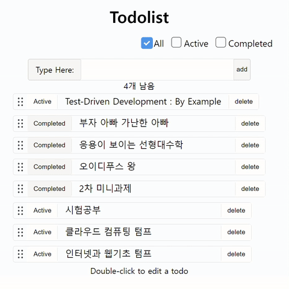
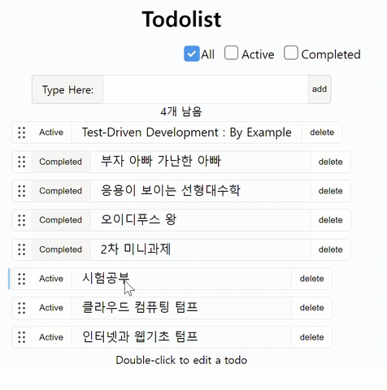
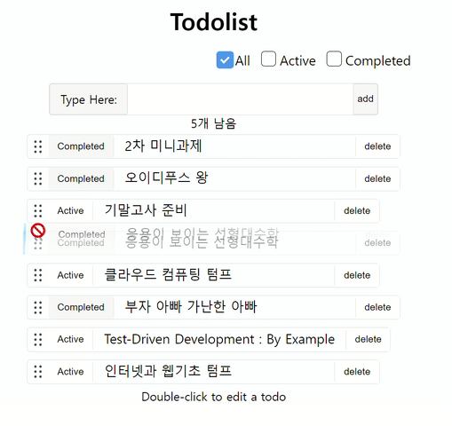

# 📖할 일 목록 - 미니과제
카카오 테크 캠퍼스 2차 미니 과제 <br/>
[React 공식 문서](https://ko.react.dev/)와 [TodoMVC](https://todomvc.com/examples/react/dist/)의 기능 동작을 참고하여 원하는 대로 UI를 자유롭게 만든다.

## Prerequisites
```
npm: >= 9.8.1
node: >= 18.18.0
```
## How to Start
```
cd my_folder
git clone https://github.com/JaeanHan/react-todo-list-precourse.git change_repo_name
```
## Installation
```
npm i
npm run start
```
## Features
- 기능 요구 사항
  - [x] 할 일을 추가하고 삭제할 수 있다.
    - [x] 할 일을 추가할 때 사용자는 Enter 키나 추가 버튼을 사용하여 할 일을 목록에 추가할 수 있어야 한다.
    - [x] 사용자가 아무것도 입력하지 않은 경우에는 할 일을 추가할 수 없다.
  - [x] 할 일의 목록을 볼 수 있다.
  - [x] 할 일의 완료 상태를 전환할 수 있다.
- 선택 요구 사항
  - [x] 현재 진행 준인 할 일, 완료된 할 일, 모든 한 일을 필터링할 수 있다.
  - [x] 해야 할 일의 총 개수를 확인할 수 있다.
  - [x] 새로고침을 하여도 이전에 작성한 데이터는 유지되어야 한다.
- 추가 기능
  - [x] 대기중인 할 일을 수정할 수 있다.
  - [x] 드래그앤드롭을 통해 할 일의 순서를 바꿀 수 있다.
## 실행결과

<br/>

<br/>

## Credit
**한재안**
- GitHub : [@JaeanHan](https://github.com/JaeanHan)