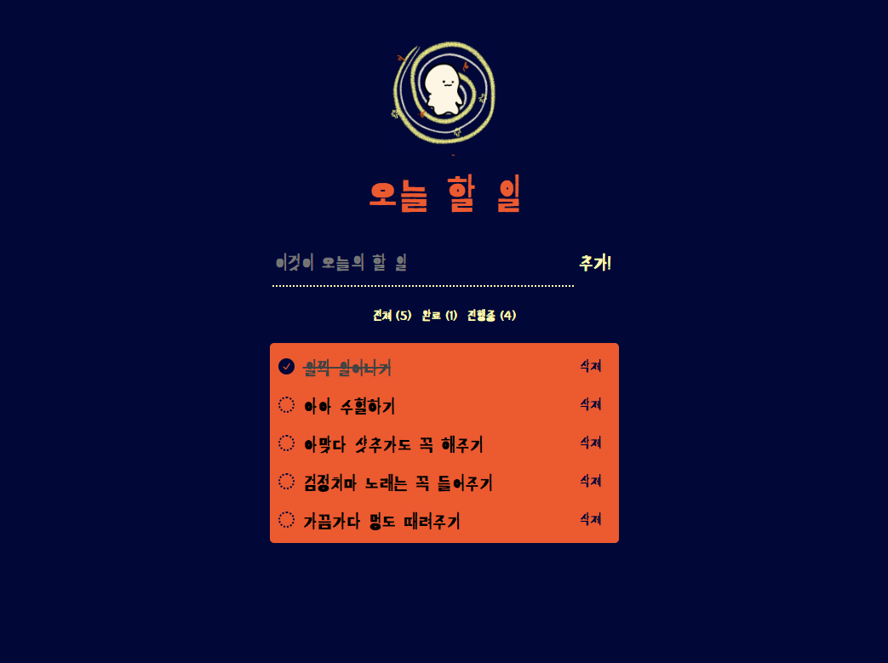

# 📒react-todo-list-precourse

React 라이브러리를 사용한 투두리스트 웹앱 구현

## ⚡요구사항 정리

- TO-DO 추가, 삭제 기능
  - 할 일을 추가할 때 사용자는 Enter 키나 추가 버튼을 사용하여 할 일을 목록에 추가할 수 있어야 한다.
  - 사용자가 아무것도 입력하지 않은 경우에는 할 일을 추가할 수 없다.
- TODO 목록을 볼 수 있다.
- TODO 완료 상태를 전환할 수 있다.

### 🍪선택 요구사항

- 현재 진행 중, 완료, 전체 TODO 필터링 기능
- 총 TODO 개수 확인
- 새로고침 할 때도 이전 데이터 유지

## 🎶구현한 기능



#### Todo 추가, 삭제 기능

- 사용자가 아무것도 입력하지 않은 경우 입력할 수 없고 alert까지!

```javascript
//src/page/Main/Main.jsx
const addTodo = () => {
  if (newTodo.trim() === "") {
    alert("오늘 할 일을 작성해보자!");
  } else {
    const newTodoItem = {
      id: Date.now(),
      text: newTodo,
      isTodoCompleted: false,
    };
    const updatedTodos = [...todos, newTodoItem];
    setTodos(updatedTodos);

    sessionStorage.setItem("todos", JSON.stringify(updatedTodos));
    setNewTodo("");
  }
};
```

#### Enter 키를 눌러도 투두 추가가 되도록.

```javascript
const handleEnterPress = (e) => {
  if (e.key === "Enter") {
    addTodo();
  }
};
```

#### 필터링 기능 및 투두 개수 확인

```javascript
//src/components/Todo/Filters
const Filters = ({ filterTodos, allCount, completeCount, activeCount }) => {
  return (
    <div className="filters">
      <button className="filterBtn" onClick={() => filterTodos("all")}>
        {" "}
        전체 ({allCount})
      </button>
      <button className="filterBtn" onClick={() => filterTodos("complete")}>
        완료 ({completeCount})
      </button>
      <button className="filterBtn" onClick={() => filterTodos("active")}>
        진행중 ({activeCount})
      </button>
    </div>
  );
};
```

#### sessionStorge를 사용하여 새로고침시 데이터 유지


```javascript
useEffect(() => {
  const storedTodos = JSON.parse(sessionStorage.getItem("todos"));
  if (storedTodos) {
    setTodos(storedTodos);
  }
}, []);
//...
sessionStorage.setItem("todos", JSON.stringify(updatedTodos));
```
