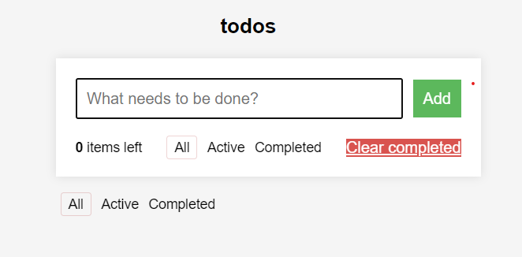
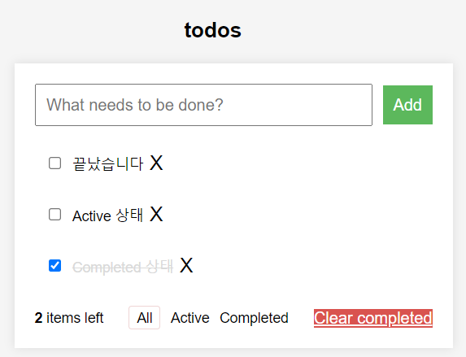
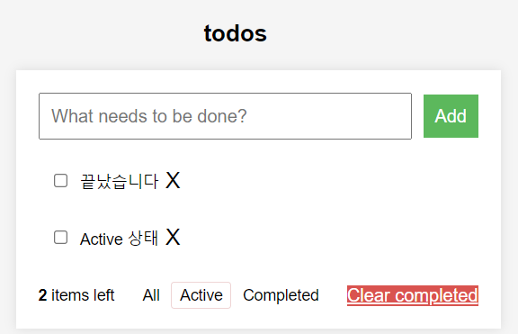
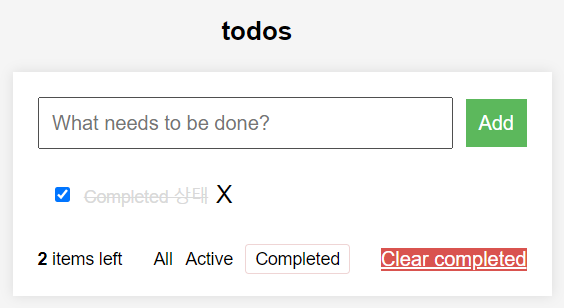

# 📖할 일 목록

[React 공식 문서](https://ko.react.dev/)와 [TodoMVC](https://todomvc.com/examples/react/dist/)의 기능 동작을 참고하여 원하는 대로 UI를 자유롭게 만든다.

- Node.js 18.17.1 버전에서 실행 가능해야 한다. 
- `package.json` 파일은 변경할 수 없으며, __제공된 라이브러리와 스타일 라이브러리 이외의 외부 라이브러리는 사용하지 않는다.__ 
- 프로그램 종료 시 `process.exit()` 를 호출하지 않는다. 
- 프로그래밍 요구 사항에서 달리 명시하지 않는 한 파일, 패키지 등의 이름을 바꾸거나 이동하지 않는다.

 

- 자바스크립트 코드 컨벤션을 지키면서 프로그래밍한다. 
  - 기본적으로 [Airbnb JavaScript Style Guide](https://github.com/airbnb/javascript)를 원칙으로 한다.
- indent(인덴트, 들여쓰기) depth를 3이 넘지 않도록 구현한다. 2까지만 허용한다.
  - 예를 들어 while문 안에 if문이 있으면 들여쓰기는 2이다.
  - 힌트: indent(인덴트, 들여쓰기) depth를 줄이는 좋은 방법은 함수(또는 메서드)를 분리하면 된다.
- 함수(또는 메서드)가 한 가지 일만 하도록 최대한 작게 만들어라.
- `import` 문을 사용하여 스크립트를 [모듈화](https://developer.mozilla.org/ko/docs/Web/JavaScript/Guide/Modules)하여 가져올 수 있도록 한다.

## Features

### 기능 요구 사항
- [x] 할 일을 추가하고 삭제할 수 있다.
  - [x] 할 일을 추가할 때 사용자는 Enter 키나 추가 버튼을 사용하여 할 일을 목록에 추가할 수 있어야 한다.
  - [x] 사용자가 아무것도 입력하지 않은 경우에는 할 일을 추가할 수 없다.
- [x] 할 일의 목록을 볼 수 있다.
- [x] 할 일의 완료 상태를 전환할 수 있다.

### 선택 요구 사항
- [x] 현재 진행 중인 할 일, 완료된 할 일, 모든 할 일을 필터링할 수 있다.
- [x] 해야 할 일의 총 개수를 확인할 수 있다.
- [x] 새로고침을 하더라도 이전에 작성한 데이터는 유지되어야 한다.

### 추가 기능
- [x] 대기중인 할 일을 수정할 수 있다.
- [x] 드래그앤드롭을 통해 할 일의 순서를 바꿀 수 있다.

### Results

