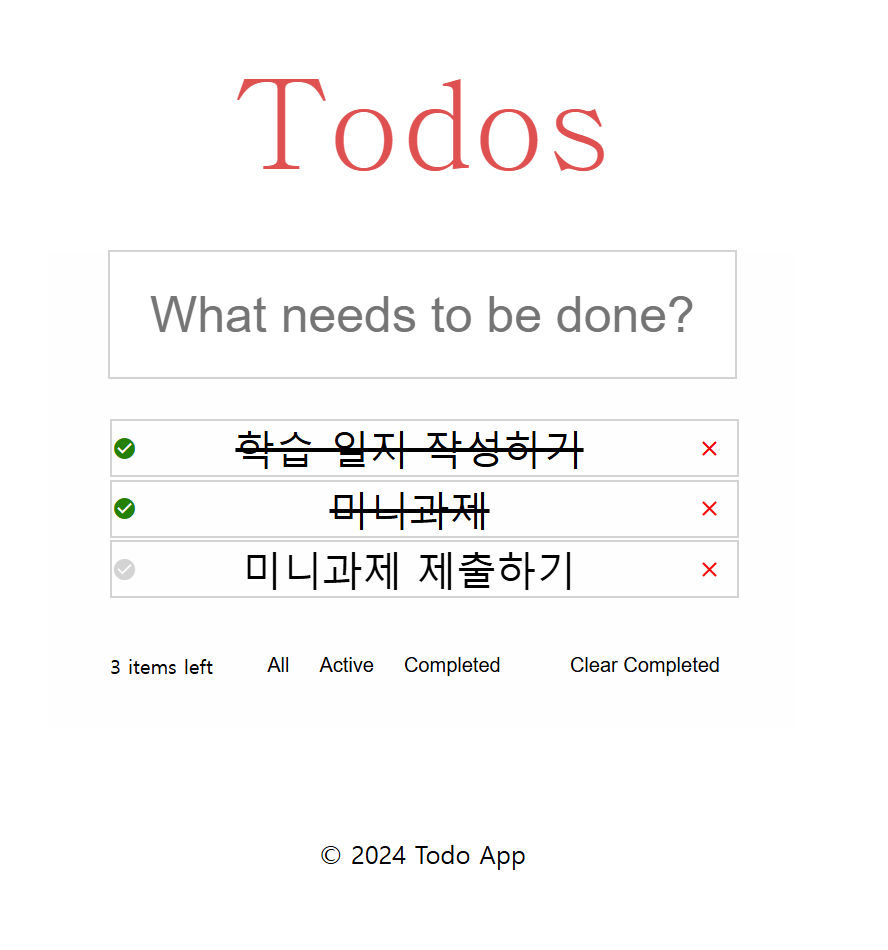

# react-todo-list-precourse
# 🗒Todos 할 일 목록 구현하기
# 🔧 기능 구현
* 하루 또는 한 주의 할 일 목록을 업데이트하는 할 일 목록을 구현한다
* 할 일을 추가, 삭제
  * 할 일을 추가 할 때 enter 키나 버튼을 사용하여 할 일을 추가 할 수 있어야 한다
  * 아무것도 입력하지 않으면, 할 일 추가 ❌
* 할 일의 목록을 볼 수 있다
* 할 일의 완료 상태 전환이 가능하다

## 선택 요구사항
  * 전체 할 일 목록, 완료된 할 일 목록, 수행되어야 할 할 일 목록을 필터링 할 수 있다.
  * 해야 할 일의 총 개수를 확인할 수 있다.
  * 새로 고침을 하여도 이전에 작성한 데이터는 유지되어야 한다.

# 구현 

## 컴포넌트
1. 웹 앱 페이지
2. header
3. todos 입력란
4. todos 출력 리스트
5. 필터링 카테고리
6. footer

### 웹 앱 페이지
### Header
Todos 의 제목란
### Todos 입력란
todoForm.jsx로 구현. 오늘 할 일을 입력하는 란으로, enter로 입력할 수 있다.
### Todos 출력 리스트
TodoForms.jsx로 구현 입력한 할 일들을 확인할 수 있다. 
할알 앞 아이콘이나 할 일의 내용을 누르면 완료 or 미완료 상태로 변경 가능하다.
X 아이콘을 누르면 할 일 삭제가 가능하다 
### 필터링 카테고리
TodoFilter.jsx로 구현. 
전체 해야할 일 내용, 수행해야 할 일, 완료 한 일, 전체 삭제를 텍스트를 눌러 필터링 가능
각 내용의 item 개수 출력 

# 실행결과

# ✅프로그래밍 요구사항
* 요구 사항 1

  * Node.js 18.17.1 버전과 React 18에서 실행 가능해야 한다.
  * React 공식 문서를 참고하여 구현한다.
  * 프로그램 실행의 시작점은 App.js이다.
  * package.json 파일은 변경할 수 없으며, 제공된 라이브러리와 스타일 라이브러리 이외의 외부 라이브러리는 사용하지 않는다.
  * 종료시 process.exit()를 호출하지 않는다.
  * 프로그래밍 요구 사항에서 달리 명시하지 않는 한 파일, 패키지 등의 이름을 바꾸거나 이동하지 않는다.

* 요구 사항 2
  * 자바스크립트 코드 컨벤션을 지키면서 프로그래밍한다.

  * 기본적으로 import Airbnb JavaScript Style Guide를 원칙으로 한다.
  * indent(인덴트, 들여쓰기) depth를 3이 넘지 않도록 구현한다. 2까지만 허용한다.
  예를 들어 while문 안에 if문이 있으면 들여쓰기는 2이다.
  힌트: indent(인덴트, 들여쓰기) depth를 줄이는 좋은 방법은 함수(또는 메서드)를 분리하면 된다.
  * 함수(또는 메서드)가 한 가지 일만 하도록 최대한 작게 만들어라.
  * import문을 사용하여 스크립트를 모듈화하여 가져올 수 있도록 한다.
* 요구 사항 3
  * 함수(또는 메서드)의 길이가 15라인을 넘어가지 않도록 구현한다.
  * 함수(또는 메서드)가 한 가지 일만 잘 하도록 구현한다.
  * 원하는 경우 TypeScript로 코드를 작성한다.